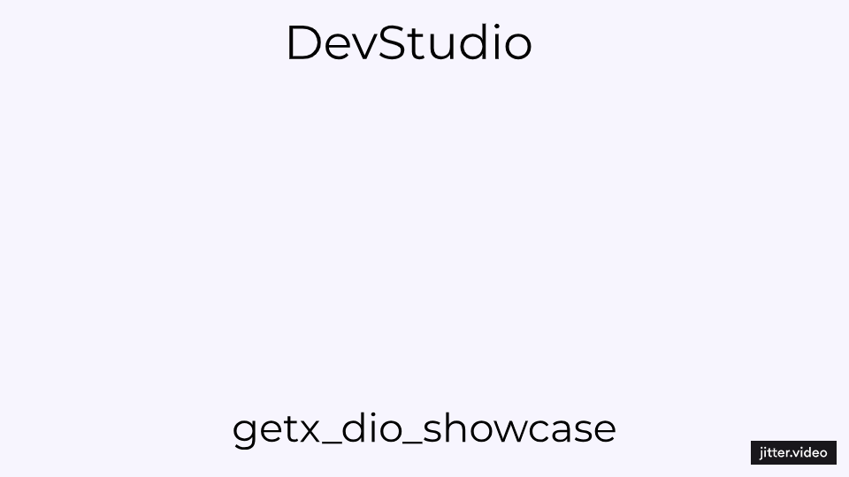

# Flutter Dio and GetX Showcase 🚀

A Flutter project demonstrating integration of Dio for API calls and GetX for state management. This showcase covers:

- 🔐 Secure authentication handling with Dio and encryption.
- 🔄 Dynamic data management using GetX controllers and observables.
- 📦 Modular architecture for scalable app development.

## 📽 Preview

## Features

- **Authentication**: Login/logout functionality with encrypted password handling.
- **Data Management**: Fetch posts and comments dynamically from an API.
- **State Management**: Utilizes GetX for reactive state management and navigation.

## How It Can Help You

This project serves as a comprehensive example for developers looking to:
- 🛠️ Understand and implement Dio for API integration in Flutter.
- 🚀 Utilize GetX for efficient state management and navigation.
- 📱 Build robust, scalable Flutter applications with modular architecture.

## Getting Started

1. Clone this repository.
2. Ensure Flutter SDK is installed.
3. Run `flutter pub get` to install dependencies.
4. Replace API endpoints in services with your own.

## Usage

Feel free to use this project as a starting point or reference for integrating Dio and GetX in your Flutter applications. Customize and extend it to suit your specific project needs.

## License

This project is licensed under the MIT License.

## About the Developer 🌟

- **👨‍💻Mo'men M.** is passionate about creating efficient and user-friendly mobile applications. With expertise in Flutter and Firebase, Mo'men focuses on delivering robust solutions that enhance user experiences and meet business objectives.
